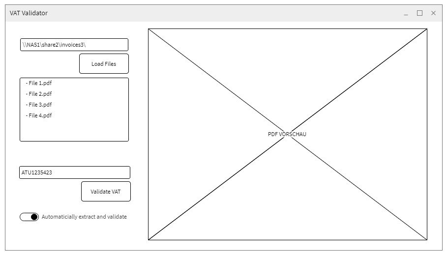

# Homework: VAT Validator Tool

## Anforderung
Ein Kunde braucht ein Prüfungsprogramm welches im bei der Kontrolle von vielen Belegen hilft. Bei den Dateien handelt es sich nur um PDF-Dateien. Diese PDF-Dateien beinhalten nur Text, können also automatisch ausgelesen werden. Es handelt sich um ca. 80.000 Dokumente die so schnell wie möglich von einem Menschen geprüft werden müssen, daher ist jeder Extra-Klick zu vermeiden und die Bedienung so einfach wie möglich zu gestalten. Im Rahmen der visuellen Prüfung muss der Anwender des Prüfprogramms auch die UID-Nummern (Umsatzsteuer-ID) der Lieferanten und Kunden prüfen. Konkret wurden beim Kunden Betrugsfälle bekannt wobei asiatische Lieferanten falsche UID-Nummern angegeben haben. Dadurch ist durch Steuerhinterziehung ein wirtschaftlicher Schaden im 5-stelligen Bereich entstanden der nun nicht nochmals passieren soll. Das Finanzamt hätten jedenfalls keine Verständnis dafür und droht mit einer Anzeige wegen Steuerhinterziehung - denn es gilt: _"If you know about or suspect VAT fraud and don’t report it, you may have to pay the tax yourself."_

Der Kunde hat zum Testen 3 Dateien zur Verfügung gestellt - alle Fälle müssen funktionieren, damit der Kunde das Programm erfolgreich abnimmt.

## Umsetzung
Das Tool soll als Desktop-Applikation entwickelt werden und auf Windows-Arbeitsplätzen laufen. Es gibt keine spezielle Anforderungen an die Benutzeroberfläche oder an den Einsatz, daher ist eine WinForms Applikation angedacht.

Im Rahmen der Analyseanforderung hat man mit dem Kunden folgendes Wireframe ausgearbeitet:

## Grundlegende Überlegungen
* Das Prüfprogramm soll ohne Installer auskommen und so wenig Abhängigkeiten zu Fremdmodulen wie möglich haben
* Die PDF-Vorschau ist jedenfalls ein "Must-Have"
* Das Programm muss auf verschiedenen Bildschirmengrößen im Vollbild-Modus ohne weiteres Funktionieren und soll dabei den verfügbaren Platz optimal nutzen 
* Der Aufbau der UID-Nummern ist pro Land anders, die einzige Vorgabe sind die ersten 2 Buchstaben
* Alle Belegen werden auf Deutsch geschrieben sein
* Es wäre ein "Nice-To-Have" wenn die Oberfläche modern und ansprechend ist
* Wünschenswert ist jedenfalls die schnelle Bedienung mit so wenig Mausklicks wie möglich - am besten nur mit Tastaturbedienung

## Git-Repository
Die Testdateien sind per git erreichbar: https://github.com/treskon/homework-1

## Abnahme
Das Repository ist zu forken und dann im privaten Space zu entwickeln. Die Aufgabe ist dann abgeschlossen wenn die Entwicklungsdateien wieder in git hochgeladen sind. Die Abnahmekritieren sind unterhalb in den User-Stories als User-Acceptance-Tests (UAT) definiert...

## User-Stories
### Dokumentenvorschau
Als Anwender möchte ich im Prüfprogramm eine Liste aller PDF-Dateien eines bestimmten Ordners sehen, damit ich die einzelnen Datei in der PDF-Vorschau öffnen kann

*UAT*
* Im Prüfprogramm gibt es zwei Bereiche: Eine Werkzeugleiste (=Toolbar) und PDF-Vorschaubereich
* In der Toolbar soll die Liste der Datei eines Ordners angezeigt werden
* Die Vorschau soll das PDF anzeigen (ähnlich wie im Internet-Browser oder Adobe Reader)
* Wird in der PDF-Datei Liste ein Dokument ausgewählt, so soll sich der PDF-Vorschaubereich aktualisieren

### Umsatzsteuer prüfen
Als Anwender möchte ich eine eingegebene Umsatzsteuer prüfen, damit ich die Angabe - die auf einem Dokument (z.B. Rechnung) steht - direkt aus dem Prüfprogramm abfragen kann.

*UAT*
* Es soll der offizielle WebService der VIES-DB der EU genutzt werden (http://ec.europa.eu/taxation_customs/vies/technicalInformation.html)
* Wenn die Prüfung erfolgreich war, soll der hinterlegte Firmenname und Firmenadresse angezeigt werden
* Falls ein Fehler passiert, soll dieser dem Anwender angezeigt werden

### Umsatzsteuer extrahieren
Als Anwender der Applikation möchte ich eine Funktion die mir bei der automatischen Extraktion von UID-Nummer hilft, so dass ich mir das Abtippen der Nummern erspare.

*UAT*
* Alle UID-Nummern im Dokument sollen automatisch bei Auswahl der Datei extrahiert werden
* Die UID-Nummer von Treskon (ATU68205701) soll von der Erkennung ausgenommen werden
* Es sollen nur UID-Nummer erkannt werden, die im Beleg-Kopf erwähnt sind (Text: USt-IdNr. NNXXXXXXX)
* Es müssen alle UID-Varianten der EU funktionieren (https://de.wikipedia.org/wiki/Umsatzsteuer-Identifikationsnummer)
* Die Extraktion muss mittels RegEx erfolgen
